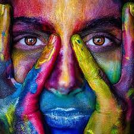
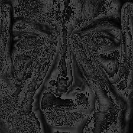
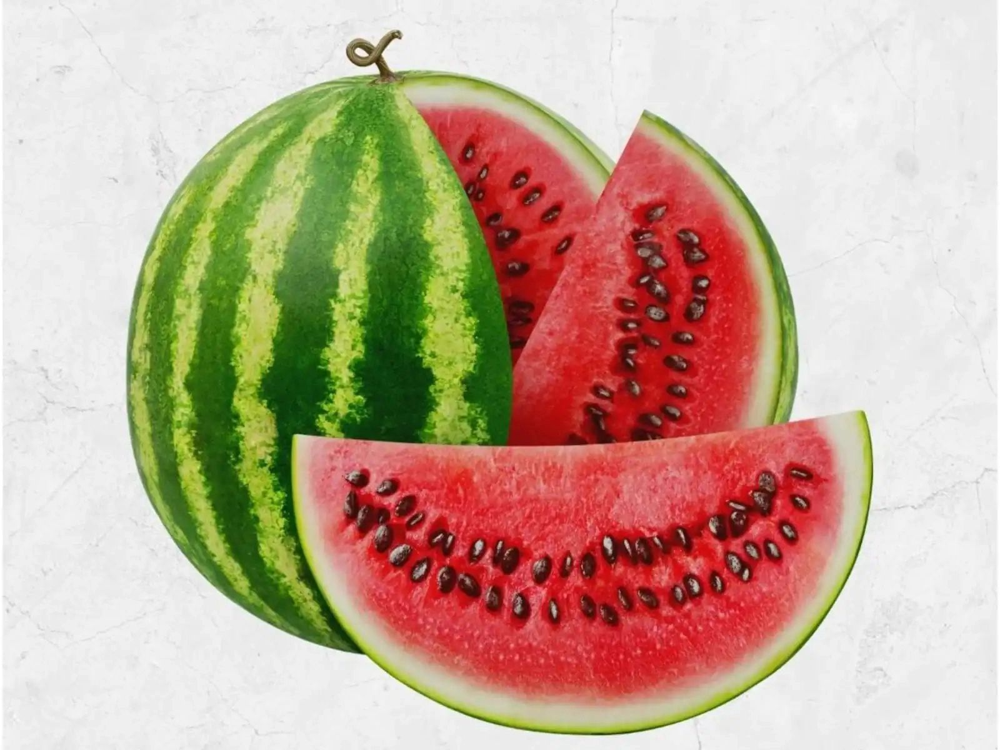
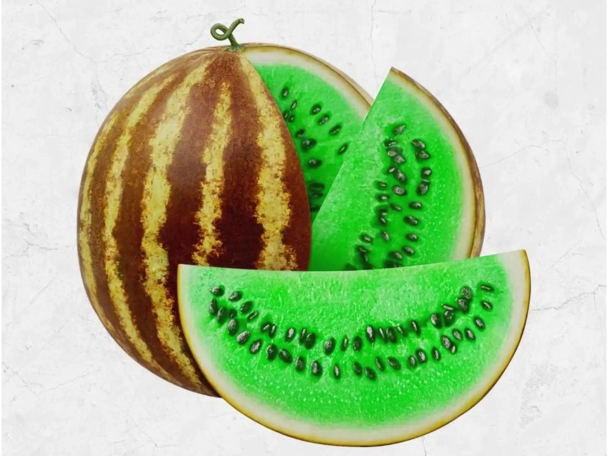
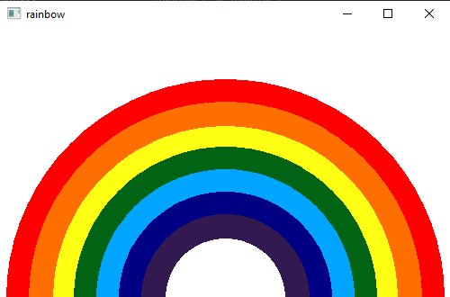
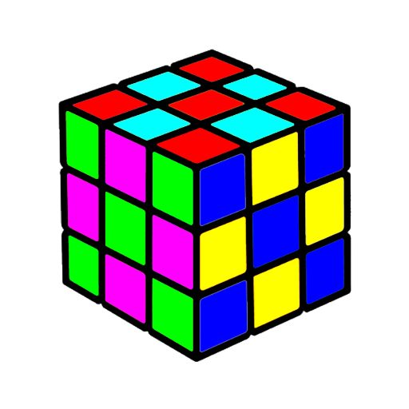
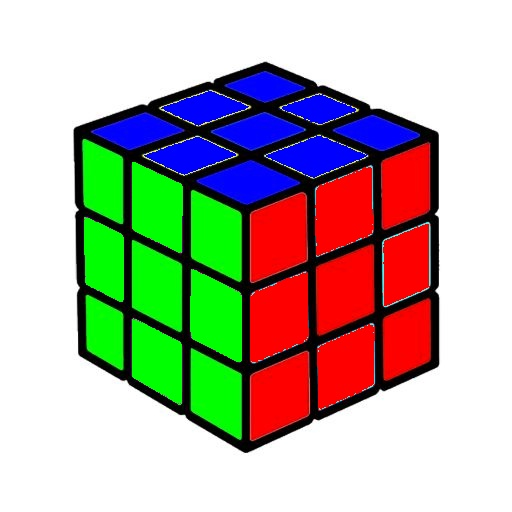
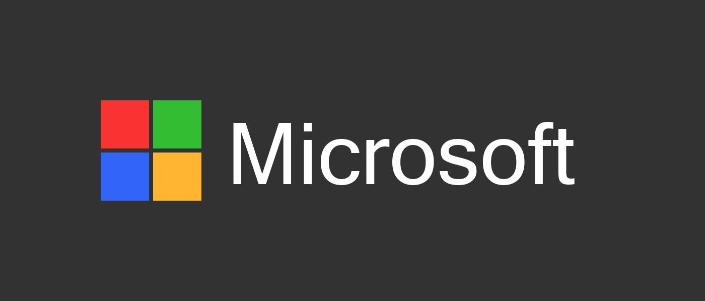

# Image Processing


simple projects using opencv with python.


## python

This project is written in Python version 3.10.8

I have used the [opencv](https://pypi.org/project/opencv-python/) and [Numpy](https://numpy.org/) 


### **How to install**
---

Run following commands:
 ```
pip install -r requierments.txt
 ```
### **My Projects**
 ---

**First**   :   **Convert RGB image to Gray**


### **How to Run**
excecute this command in terminal:
 ```
 RGBtoGray\main.py
  ```
   

input
---


---

### **result**


---



---
**Second**   :   **Convert Watermelon to materwelon**


### **How to Run**
excecute this command in terminal:
 ```
 Watermelon\main.py
  ```
### **input**   

### **result**
---



---

**Theard**   :   **Draw rainbow**


### **How to Run**
excecute this command in terminal:
 ```
 rainbow\main.py
  ```

### **result**
   


---

**Forth**   :   **Solve the Rubik cube**


### **How to Run**
excecute this command in terminal:
 ```
 Rubik cube\main.py
  ```
### **input**   

### **result**
   

---

**Fifth**   :   **Design Microsoft logo**


### **How to Run**
excecute this command in terminal:
 ```
 Microsoft_logo\main.py
  ```

### **result**
   
